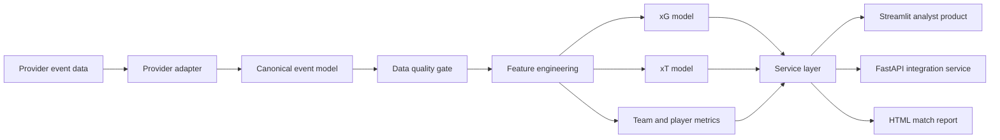

# Architecture

## Design decisions

- **Provider-neutral data model:** analytics are decoupled from a vendor-specific schema.
- **Research/product separation:** model code is isolated from dashboard and API concerns.
- **Match-aware evaluation:** events from the same match do not appear in both train and test sets.
- **Transparent baseline models:** logistic regression and empirical xT make assumptions inspectable.
- **Reusable service layer:** UI, API and report generation consume the same calculations.
- **Governance by design:** quality checks, model cards and limitations are part of the repository.

## Production evolution

A club deployment would typically add object storage, an orchestration layer, a feature store or curated warehouse, model registry, authentication, role-based access, logging, monitoring and automated provider reconciliation.
